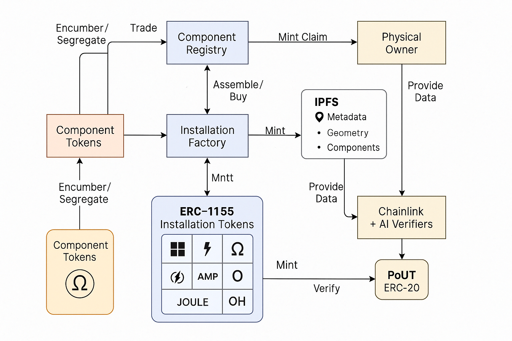

## **Proof of Existence**

The Proof of Existence web3 project uses chainlink functions and an EVM compatible "smart" contract to present pairs of aerial images extracted from ipfs metadata json objects and from an open tiling service and use computer vision to compare the stored image url from the metadata to the independent image from a tiling service to confirm the existence of a piece of energy infrastructure (solar farm, substation, wind farms, hydroelectric plant, etc.) exists and matches key metadata items (location, geometry, size, components).

y

## 🔁 **High-Level Workflow**

1. **Metadata Submission**: 
   - A user or oracle submits an IPFS JSON metadata object (with `image`, `geometry`, `location`, `component` tags).
   - This metadata is hashed and referenced in an on-chain `ProofOfExistence` contract.

2. **Chainlink Functions Trigger**:
   - A Chainlink Function is triggered (via scheduled job, user trigger, or event hook).
   - The Function retrieves:
     - Image URL from IPFS metadata.
     - Location and bounding box.
     - Aerial tile from a public tiling service (e.g., Mapbox, OpenStreetMap, Google Earth Engine).

3. **Image Analysis (Off-chain)**:
   - Computer vision model compares:
     - IPFS image vs. live tile.
     - Bounding polygon vs. infrastructure features.
     - Component presence (e.g., solar panels, turbines).

4. **Verification Result Posted**:
   - The result (true/false + similarity score + error type) is posted back to the smart contract.
   - Optionally, store additional verification data hash (e.g., image diff) to IPFS and reference it on-chain.

5. **Smart Contract Stores Final Verdict**:
   - Sets verification status.
   - Allows querying of existence proofs.

---

## 🧱 **System Architecture (Modular Components)**

### 1. **Smart Contract Layer (EVM Compatible)**
- **PoERegistry.sol**:
  - Registers submitted infrastructure metadata hashes.
  - Emits events to trigger Chainlink Functions.
  - Stores verification results (bool + timestamp + confidence + image diff hash).
  - Role-based access: user submission vs. oracle verification.

- **ComponentRegistry.sol**:
  - Stores reusable definitions of component types (solar module, turbine, etc.).
  - Optional: ERC-1155 NFT backing for each infrastructure site.

---

### 2. **Chainlink Function Job**
- **Trigger Conditions**:
  - Manual (via frontend).
  - Periodic (cron).
  - Event-based (metadata submitted or NFT minted).

- **Job Logic**:
  - Fetch IPFS JSON and extract metadata.
  - Fetch tiles using lat/lon and zoom level.
  - Run vision model or call external API.
  - Post result back via callback function or Chainlink Functions direct fulfillment.

---

### 3. **Off-chain Verifier (Serverless Function / Microservice)**
- **Responsibilities**:
  - Normalize and align both images.
  - Use ML model (e.g., CNN, Vision Transformer, CLIP) to compute similarity.
  - Optionally detect components (YOLOv8 or similar).
  - Store diff results to IPFS if needed.

- **Stack**: Python (FastAPI), or Node.js if unified with frontend.

---

### 4. **IPFS Layer**
- Stores:
  - Metadata JSONs.
  - Original aerial image snapshots.
  - Computer vision diff or intermediate results.
  - Off-chain verifier logs (optional).

---

### 5. **Frontend dApp**
- **User Workflow**:
  - Submit metadata or browse existing infrastructure claims.
  - View aerial image pairs and verification results.
  - Interact with the contract (via ethers.js / viem).
  - Possibly upload/verify image diffs.

- **Tech Stack**:
  - React + ethers.js/viem + Tailwind.
  - Map-based interface (Leaflet.js or MapLibre GL).
  - Optionally allow crowdsourced verification or voting on false positives.

---

## 🔐 **Security & Trust Anchors**
- All metadata immutable via IPFS + hash-on-chain.
- All comparisons verified through Chainlink oracles and off-chain attestations.
- Optional: ZK-proof of vision model output (future enhancement).
- Audit trail for each submission and verification.

---

## 🔄 **Optional Extensions (For Future)**
- ERC-1155 infrastructure NFTs linked to verified locations.
- Dynamic metadata (e.g., energy production).
- ZKML proofs of image similarity (experimental).
- DAO-governed verification parameters or retraining of vision model.
